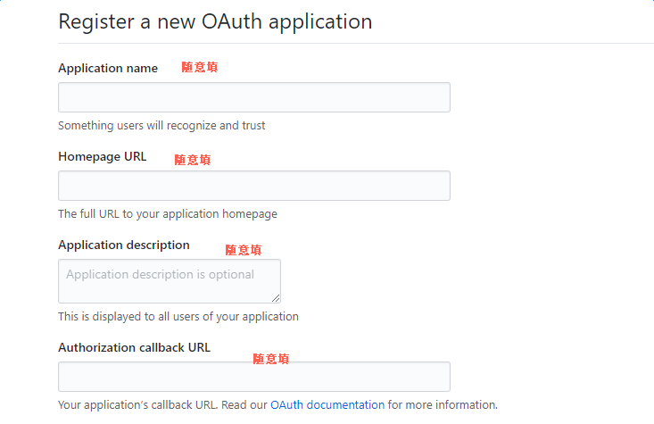
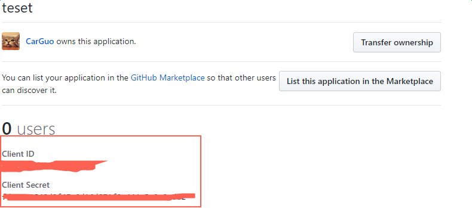
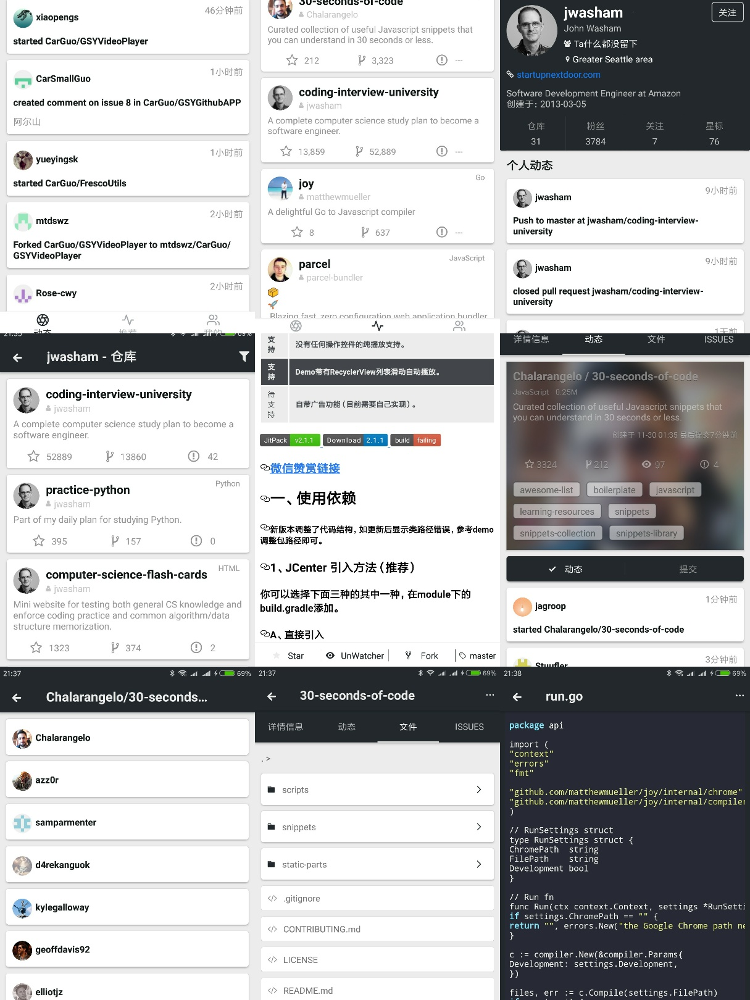
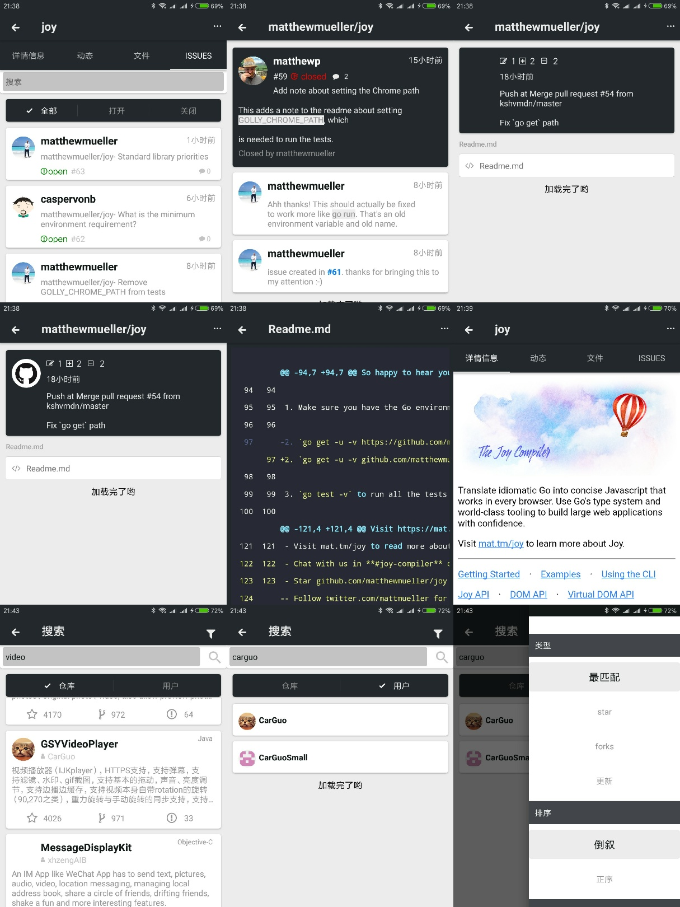
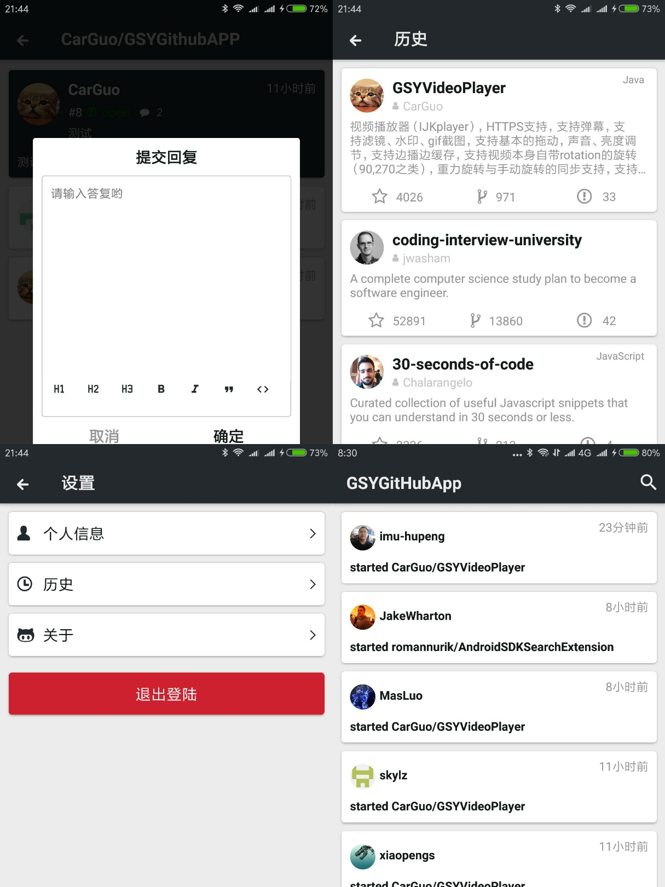

## GSYGithubAPP

### 特别说明
这是一个功能完善的 RN 实例项目，从 https://github.com/CarGuo/GSYGithubAPP fork 而来，所有权全部归项目创建者所有。

项目创建者编写的原始 README 文档在这里：[原始README文档](./README.bak.md)。

在我的这个分支上，按照我自己的习惯对目录结构、代码风格等进行了大幅度修改，但并没有增加、修改功能。

-----

### 使用方法

- 配置好react native开发环境，可参阅 [【搭建环境】](http://reactnative.cn/docs/0.51/getting-started.html) | [【React Native开发（一、入门）】](http://www.jianshu.com/p/97692b1c451d)
- clone代码，根目录下执行`npm install`安装node_modules(太慢建议科学上网或使用淘宝镜像)
- 重点：你需要自己在app/config目录下 创建一个ignoreConfig.js文件，然后输入你申请的Github client_id 和 client_secret。

    export const CLIENT_ID = "xxxx";

    export const CLIENT_SECRET = "xxxx";

    //如果需要上传七牛
    
    export const ACCESS_KEY = "xxxx";

    export const SECRET_KEY = "xxx";

    export const QN_HOST = "xxxx";

    export const SCOPE = "xxxx";

    [注册 Github APP 传送门](https://github.com/settings/applications/new)，当然，前提是你现有一个github账号(～￣▽￣)～ 。
  
    

        
        
    

- MAC上使用xcode运行，Windows机器在命令行用`react-native run-android`启动项目，记得先起模拟器。

**特别注意：如果在启动项目时出现了node相关的错误，请使用 npm chache clean 清掉所有本地缓存，然后 重新执行 npm install。如果npm速度慢，尝试把registry设置成淘宝的源。**

### 运行效果

### 技术栈

* [react-native(0.57.5)](http://reactnative.cn/docs/0.51/getting-started.html)
* [react-native-router-flux 路由框架](https://github.com/aksonov/react-native-router-flux)
* [react-native-vector-icons 矢量字体库图标 ](https://github.com/oblador/react-native-vector-icons)
* [react-redux redux](https://github.com/reactjs/react-redux)
* [realm-js realm 数据库](https://github.com/realm/realm-js)
* [react-native-i18n 多语言](https://github.com/AlexanderZaytsev/react-native-i18n)
* [react-native-image-viewer 图片预览](https://github.com/ascoders/react-native-image-viewer)
* [react-native-modalbox 模态框](https://github.com/maxs15/react-native-modalbox)
* [react-native-spinkit loading](https://github.com/maxs15/react-native-spinkit)
* [react-native-textinput-effects 输入框](https://github.com/halilb/react-native-textinput-effects)
* [url-parse url解析](https://github.com/unshiftio/url-parse)
* [lottie](https://github.com/airbnb/lottie-react-native)

### 常见问题

* xcode的运行，第一次下载 react native 和 realm 相关包比较耗时。[iOS RN 0.45以上版本所需的第三方编译库(boost等)解决](http://reactnative.cn/post/4301)

* win下在npm出现问题时，再次npm时可以删除.lock文件先（如果是mac就简单很多了）。

### LICENSE
Apache License 2.0

本人修改、增加的任何功能完全free，其它请遵守项目原始创建者的版本声明：https://github.com/CarGuo/GSYGithubAPP
